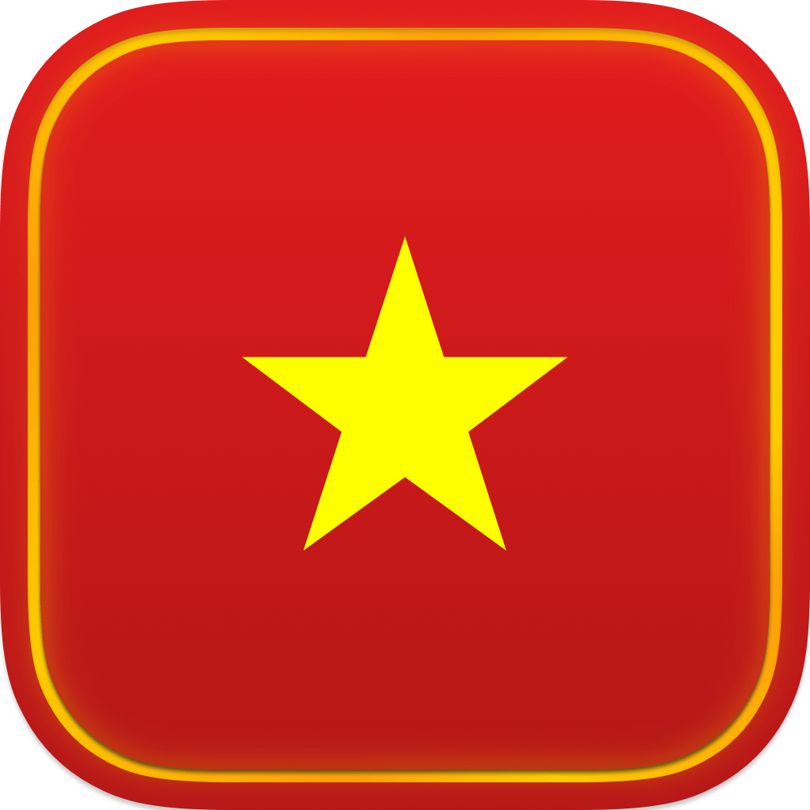

<p align="center">
    
</p>

<p align="center">
    
    <a href="https://keyboardkit.github.io/KeyboardKitPro"></a>
    
    
</p>


# Vietnamese Input

VietnameseInput is a Swift SDK that lets you add Vietnamese typing in TELEX, VNI, and VIQR to your apps.

VietnameseInput is currently in internal beta, but you can [reach out][Email] if you want to become a beta tester.

<!--VietnameseInput requires a license to be used. You can sign up on the [KeyboardKit website][Website] or the [Gumroad store][Gumroad].-->


## Installation

VietnameseInput can be installed with the Swift Package Manager:

```
https://github.com/Kankoda/VietnameseInput.git
```

VietnameseInput is a closed-source package and must therefore only be linked to the main app target.


## Getting started

TBD.

<!--For more information, see the [getting started guide][Getting-Started] and [essentials][Essentials] articles.-->


## Documentation

TBD.

<!--The [online documentation][Documentation] has a thorough getting-started guide, a detailed article for each feature, code samples, etc. You can also build it from the source code to get better formatting.-->


## Demo App

TBD.


## Contact

VietnameseInput is developed by Swedish company Kankoda.

* Website: [kankoda.com/VietnameseInput][Website]
* E-mail: [info@kankoda.com][Email]
* Bluesky: [@kankoda.bsky.social][Bluesky]
* Mastodon: [@kankoda@techhub.social][Mastodon]

Feel free to reach out if you have any questions or feedback, or if you need support.


## Commercial License

This package requires a license to be used. You can sign up on the [package website][Website] or the [Gumroad store][Gumroad].


[Email]: mailto:info@keyboardkit.com
[Website]: https://kankoda.com/vietnameseinput
[Bluesky]: https://bsky.app/profile/kankoda.bsky.social
[Mastodon]: https://techhub.social/@kankoda
[Sponsors]: https://github.com/sponsors/danielsaidi

[Gumroad]: https://kankoda.gumroad.com
[Documentation]: https://kankoda.github.io/VietnameseInput/
[License]: https://github.com/Kankoda/VietnameseInput/blob/master/LICENSE

[Getting-Started]: https://kankoda.github.io/VietnameseInput/documentation/vietnameseinput/getting-started-article
